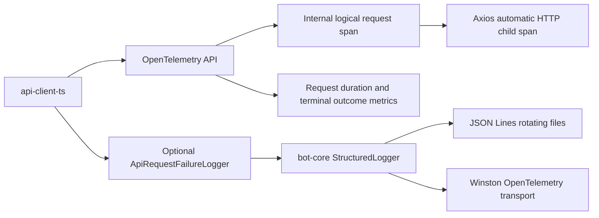

# OTel-native API client design

## Intent

Make `@medrunner/api-client` a well-behaved OpenTelemetry library.
It must contribute traces and metrics to any application that has registered an OpenTelemetry SDK.
It must not create an SDK, select an exporter, mutate global OpenTelemetry configuration, or require an exporter destination.

Terminal API failures must remain available through the existing `ApiResponse` contract.
When a supplied logger supports the new typed failure capability, the same failure must also be emitted as flat structured fields.
`bot-core` must implement that capability so rotating JSON Lines files and the existing Winston OpenTelemetry transport expose Problem Details as inspectable attributes.

The scope is limited to `api-client-ts` and `bot-core`.
No bot application, staff client, portal, tag, GitHub release, or package publication is part of this change.

## Release contract

`api-client-ts` remains on the `0.7.0` line and will be published only by a GitHub prerelease tagged `v0.7.0-beta.29`.
Its publish workflow derives the published package version from that release tag.

`bot-core` will declare version `0.13.9-beta.1` and will publish only when a matching `v0.13.9-beta.1` tag is pushed.
Its tag-triggered workflow publishes the committed package version, so its package version and tag must match exactly.

This task changes neither tag nor release.

## Architecture



`api-client-ts` will add the stable `@opentelemetry/api` package as a runtime dependency.
It will obtain a tracer and meter by instrumentation scope name `@medrunner/api-client`.
All providers remain no-op until a downstream application registers a compatible SDK.

Each `ApiEndpoint.makeRequest` invocation will create one `SpanKind.INTERNAL` span named `medrunner.api.request`.
The span starts before request configuration is built and remains active across an authentication invalidation and its single retry.
Existing Axios instrumentation may create a nested HTTP client span and propagate the active context without changes from this client.

The client will never record a raw Axios exception because its request configuration can contain authorization data.
It will instead record only the sanitized outcome attributes defined below.

## Telemetry contract

### Stable low-cardinality dimensions

Every span and metric observation uses these dimensions where present.

| Attribute                   | Source                                                        | Cardinality rule          |
| --------------------------- | ------------------------------------------------------------- | ------------------------- |
| `medrunner.api.endpoint`    | Endpoint class name, such as `EmergencyEndpoint`              | Fixed client classes only |
| `http.request.method`       | The HTTP verb                                                 | Five fixed values         |
| `server.address`            | Parsed API host                                               | Deployment-level value    |
| `http.response.status_code` | Terminal HTTP response status                                 | HTTP status code only     |
| `error.type`                | `http.response` for an HTTP response or `transport` otherwise | Two fixed values          |
| `medrunner.api.retry_count` | Authentication retries for the logical request                | `0` or `1`                |

No metric includes a URL path, URL query, correlation key, user identifier, request header, request body, raw response body, Problem Details `detail`, or `instance`.

### Traces

Successful spans end with `SpanStatusCode.UNSET` and include the response status when present.
Terminal failures end with `SpanStatusCode.ERROR` and include the stable outcome dimensions.
The span adds a sanitized `exception` event containing only `exception.type`, with the fixed `http.response` or `transport` value.
The event does not contain a raw error object, request configuration, headers, request body, or full response body.

### Metrics

The meter creates these instruments.

| Instrument                              | Type and unit        | Recorded when                                                |
| --------------------------------------- | -------------------- | ------------------------------------------------------------ |
| `medrunner.api.client.request.duration` | Histogram, `s`       | Every terminal logical request, including a successful retry |
| `medrunner.api.client.request.failures` | Counter, `{request}` | Every terminal failed logical request                        |
| `medrunner.api.client.request.retries`  | Counter, `{retry}`   | The single authentication retry begins                       |

Duration and failure observations use only the low-cardinality dimensions.
The retry counter uses endpoint, method, and server address.

## Structured failure logging contract

`api-client-ts` will export the following public interfaces from its package root.

```ts
export interface ApiRequestFailure {
  endpoint: string;
  method: "GET" | "POST" | "PUT" | "PATCH" | "DELETE";
  serverAddress?: string;
  path?: string;
  statusCode?: number;
  retryCount: number;
  errorType: string;
  responseBody?: string;
  responseBodyTruncated: boolean;
  problemDetails?: ProblemDetails;
}

export interface ApiRequestFailureLogger {
  logApiRequestFailure(failure: ApiRequestFailure): void;
}
```

The existing optional `ts-log.Logger` argument remains unchanged.
At runtime, the client detects whether that logger also implements `ApiRequestFailureLogger`.
Without the capability, it preserves the existing warning and error plaintext messages.

The normalized `responseBody` is the current string `ApiResponse.errorMessage` representation, limited to 16 KiB for logs and marked by `responseBodyTruncated` when shortened.
`ApiResponse.errorMessage` itself remains uncapped, preserving the existing response contract.

When `problemDetails` is present, `bot-core` maps it to primitive fields.

| Structured field                 | Value                     |
| -------------------------------- | ------------------------- |
| `medrunner.api.problem.type`     | `problemDetails.type`     |
| `medrunner.api.problem.title`    | `problemDetails.title`    |
| `medrunner.api.problem.status`   | `problemDetails.status`   |
| `medrunner.api.problem.detail`   | `problemDetails.detail`   |
| `medrunner.api.problem.instance` | `problemDetails.instance` |

`bot-core` also writes the normalized HTTP fields, retry count, response body, and truncation flag as top-level Winston metadata.
The existing lowercase Winston `message` remains plaintext for console and OTLP log bodies.
The JSON rotating-file transport serializes the same metadata as a JSON object per line.

Failure severity remains `warn` for a terminal 4xx response and `error` for a terminal 5xx or transport failure.

## bot-core integration

`StructuredLogger` will implement `ApiRequestFailureLogger` while retaining its `Logger` methods and configuration-level filtering.
It will construct a short plaintext message and pass the flat metadata into `writeStructuredLog`.
`StructuredLogEntry` and `writeStructuredLog` will accept additional primitive attributes without changing legacy fields such as `Message`, `CorrelationKey`, `SpanId`, and `TraceId`.

No metric reader or exporter code changes are required in `bot-core`.
Its installed `@opentelemetry/sdk-node` version initializes metric readers from `OTEL_METRICS_EXPORTER` when its existing telemetry bootstrap starts.
Deployment environment variables continue to own telemetry destinations, protocol, batching, sampling, resources, and signal selection.

`bot-core` updates its fixed `@medrunner/api-client` dependency to `0.7.0-beta.29` only after that prerelease has been published.

## Compatibility and non-goals

Existing constructors, `buildClient` signatures, `ApiResponse` fields, and ordinary `ts-log.Logger` implementations remain compatible.
The typed structured logging capability is additive and optional.

This change does not require consumers to add source code to receive spans and metrics.
Consumers only need an OpenTelemetry SDK and exporters when they want signals exported.
The JavaScript logs API is not used by the client because it remains under development.
Structured logs reach OTel through downstream logging bridges, beginning with `bot-core`'s existing Winston transport.

The staff API client and browser portals are intentionally unchanged.
They can consume the released core client later, while browser OTel instrumentation remains an explicit application-level decision.

## Verification

`api-client-ts` tests will use recording OpenTelemetry API providers to verify one logical span, terminal status, dimensions, duration, failure count, retry count, and absence of raw Axios exception data.
They will verify structured Problem Details delivery, plaintext fallback behavior, a 4xx failure, a 5xx failure, a transport failure, and a successful authentication retry.

`bot-core` tests will assert that an `ApiRequestFailure` writes a plaintext message plus flat primitive attributes to Winston metadata and therefore to JSON Lines and the Winston OTel transport.
They will retain the current transport separation between JSON files and plaintext OTLP or console bodies.

Both repositories will run their focused tests, full test suite, lint, package build, and package dry-run validation where available.
`git diff --check` will verify the final patch.
